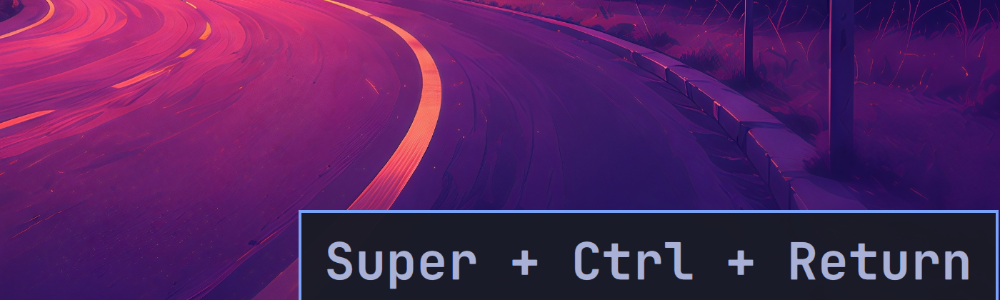
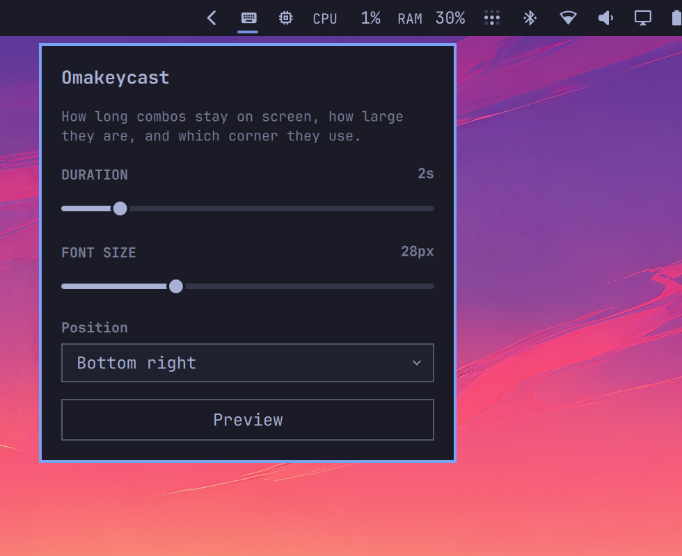

# Omakeycast

On-screen keybinding overlay for [Omarchy](https://omarchy.org/). While you
record your screen, Super, Ctrl, and Alt combinations appear at the bottom
right of every monitor for a short time, on top of other windows.

By default it shows **Hyprland keybinds only** — no extra permissions. Bare
keys and Shift-only typing stay hidden. Shift is included only when it is
held together with Super, Ctrl, or Alt:

- `Super + Return`
- `Super + Ctrl + V`
- `Alt + Tab`



Click the keyboard icon on the bar to change duration, font size, and corner:



## Install

```sh
omarchy plugin add https://github.com/fredimachado/omakeycast.git --enable
```

The overlay starts as soon as the plugin is enabled. A keyboard icon is added
to the right side of the bar; click it to change duration, font size, and
corner from a panel. Move it with `omarchy bar move`.

### Optional: in-app shortcuts

To also show application chords such as `Ctrl + A` and `Ctrl + C`, grant
read access to `/dev/input` (the plugin never grabs the device) and log out:

```sh
sudo usermod -aG input "$USER"
```

After the next login, Omakeycast notices the extra access and switches to
full capture on its own. Until then it keeps showing Hyprland binds only.

## Configure

Click the keyboard icon on the bar. Changes write to
`~/.config/omarchy/shell.json` and the overlay reloads them on save.

You can also edit the plugin or bar-layout entry by hand:

```json
{
  "plugins": [
    {
      "id": "io.github.fredimachado.omakeycast",
      "duration": 2,
      "fontSize": 28,
      "position": "bottom-right"
    }
  ]
}
```

| Setting    | Default          | Meaning                                              |
| ---------- | ---------------- | ---------------------------------------------------- |
| `duration` | `2`              | Seconds the combo stays visible                      |
| `fontSize` | `28`             | Label size in pixels                                 |
| `position` | `bottom-right`   | `bottom-right`, `bottom-left`, `top-right`, `top-left` |

## Usage

Press a Hyprland shortcut (or any Super/Ctrl/Alt chord after joining the
`input` group). The HUD appears on every screen, ignores mouse clicks, and
fades after `duration` seconds. A new combo resets the timer. The bar panel's
Preview button shows a sample combo without pressing a shortcut.

If the icon is missing after an upgrade from an overlay-only install, disable
and enable the plugin so Omarchy can place the widget on the bar:

```sh
omarchy plugin disable io.github.fredimachado.omakeycast
omarchy plugin enable io.github.fredimachado.omakeycast
```

To preview the overlay without pressing a shortcut:

```sh
omarchy-shell omakeycast show '{"text":"Super + Ctrl + Return"}'
```

Hide it with:

```sh
omarchy-shell omakeycast close
```

## Remove

```sh
omarchy plugin remove io.github.fredimachado.omakeycast
```

## Development

```sh
make check
```

That validates the manifest, runs the combo and settings tests, and lints
the overlay, bar widget, and settings panel against the installed Omarchy
shell imports.

`qmllint` may warn that it cannot resolve `qs.Commons` / `qs.Ui` outside a
running Quickshell session. The same imports are used by first-party plugins
such as the OSD.

## License

MIT
